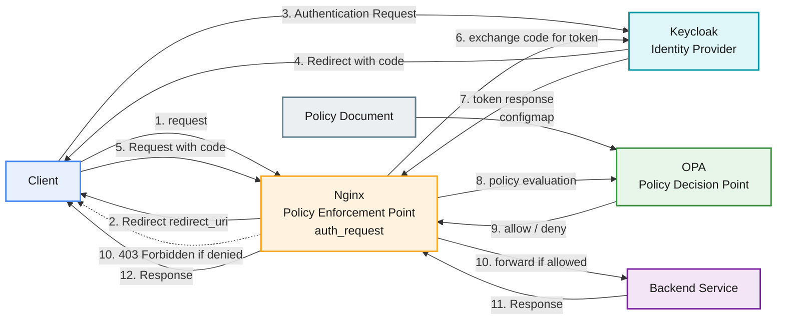

## 技術スタック

- minikube (デプロイ先)
- helm 3 (デプロイメント記述)
- python 3.14
  - FAST API (REST Service)
- keycloak (IdP)
- nginx (OpenID proxy, PEP)
- Open Policy Agent (PDP)
- CloudNativePG (keycloak backend)

## 構成図

## プロジェクト構造

- `authzen/` - プロジェクトの根ディレクトリ
  - `apps/backend` - FastAPI サービス
    - `src/` - アプリケーションコード
    - `tests/` - ユニット・API テスト
    - `Dockerfile`
    - `pyproject.toml` or `requirements.txt`
    - `README.md` - 開発者向け説明
  - `charts/` - helm chart
    - `authzen/` - helm chart
      - `Chart.yaml`
      - `values.yaml`
      - `templates/`
        - `backend/`
        - `nginx/`
        - `opa/`
        - `keycloak/`
  - `policies/` - 認可ポリシー
    - `opa/` - Rego ファイル群
      - `example.rego`
    - `authzen/` - （将来の AUthZEN API 用）
  - `infra/` - インフラ関連マニフェスト
    - `k8s/`
      - `minikube-setup.md` - 立ち上げ手順
      - `keycloak.yaml`
      - `nginx.yaml`
      - `opa-configmap.yaml`
  - `scripts/` - 各種スクリプト
    - `deploy.sh` - minikube/helm デプロイ
    - `reset-env.sh` - ローカル再構築
    - `test-e2e.sh`
    - `generate-certs.sh` - SSL証明書作成スクリプト
  - `certs\` - privateCA証明書およびそれで生成した各サーバ証明書配置場所
  - `tests/` - E2E／インテグレーション
    - `integration/`
    - `e2e/`
  - `docs/` - 既存ドキュメント
    - `authorization_2024-2026.md`
    - `api-spec.yaml` - backend API仕様
    - `images/`
  - `README.md` - プロジェクト概要・開始手順
  - `Makefile` - 省力化用タスク集

## サービス仕様

### backend service

- OPAの認可確認のためのサンプルREST API Service
- `docs/api-spec.yaml`を実装。
- エクステンド目標: PEPをMiddlewareにしたケースの確認
  - FAST APIのdependsを用いてエンドポイント毎の認可をOPAに送るMiddlewareを実装
    - 環境変数`OPA_MIDDLEWARE`でmiddlewareをON/OFF
    - 環境変数`OPA_URL`で認可問い合わせのOPAサービスを指定

### OPA

- REST APIの認可ポリシーをRegoで記述
- local volumeをマウントしてポリシーを底に配置
- ポリシーファイルが更新されたら動的に反映
- nginxまたはbackendのmiddlewareから認可要求を受け付けallow/denyを判定
  - 入力パラメタ
    - Authorization: ヘッダのOIDC access token(JWT)
      - payloadのsubjectとroleを読み取る
    - method
    - path

### nginx

- 1. OIDC proxyとして動作し、KeycloakとAuthorization Code FlowでTokenを取得する
- 2. backend REST APIリクエストに対してauth_request経由で認可リクエストを行う
  - request header, method, path, queryをOPAの入力として渡す。
- 3. 認可パスした場合backendへリクエスト転送する
- https requestのTLS terminationを行う。

### keycloak

- opatest realmsを作成
  - oidc clientとして`opatest_client`を作成
  - IdPとしての設定を行う
  - アプリケーションの認証ユーザとして`test`ユーザを作成
