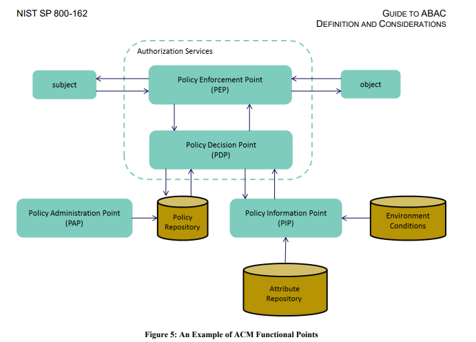

# 近年のAuthorization動向

---

## はじめに

- OIDC + OPAをrecommend
- 生成AIブーム以降の動向を見てなかったなと
- OpenID foundationでAuthorization仕様を検討してたのは・・・
  - ちょうど2026年3月5日にAuthorization API 1.0が出たとこだった。
- AuthN/AUthZの基本と動向
  - KubeConに[AuthZEN紹介資料](https://static.sched.com/hosted_files/kccncna2024/e4/AuthZEN%20OIDC%20of%20Authorization.pdf)にいいのがあった

---

## AuthZEN: the "OIDC" of Authorization

- プレゼンタはTopazというクラウド認可サービスを出してるAsertoの人
- 認証と認可の違い。
  - OIDCはIdPとSubject Stoken交換で認証
  - 認可はOAuth2によるRPのEndpoint認可
- OIDCでは認可が不十分であり、その課題を解決するための認可サービス
- 認可サービス間のInteropのためのAPI仕様がAUthZEN

---

## 認可サービスの課題

|      | 従来の認可      | モダンな認可サービス |
|:---- | :-----         | :-------            |
| What | サービス単位の粗粒度 | Resource単位の細粒度  |
| How  | アプリ埋め込み 独自実装でセキュリティリスク  | ポリシーベース アプリに独立したAuthZ Service |
| When | ログイン時(Token生成時) 再ログイン時に権限変更が反映 | リアルタイム(リクエスト毎) ポリシーの変更が即時に反映される |
---

## アクセス制御の進化

- ACL: ユーザに権限を付与
- RBAC: 権限リストを役割(Role)として定義し、ユーザに割り当てる
  - 各社IAMとかは基本これ。
- ABAC: subject,Resource, Context属性を組み合わせてアクセスを制御
  - IAMでtagとかを使ってスコープを動的制御するのはこちらの考え方。 
  - マルチテナントでresource listをorganization IDでフィルタする、とか
- ReBAC: 関係性をすべてGraphで記述
  - Google ZanzibarとかOpenFGA。階層化されたリソースとかに向く。
  - インスタンス単位の関係性まで管理される

---

## NIST ABAC Service Point

---

## ポリシーベースアクセス管理

- アプリケーションからアクセス制御ロジックを分離
- Policy enforcement point(PEP)から認可サービス(PDP: policy dicision point)を呼ぶ
  - Gateway型: nginx auth_requestからOPAを呼ぶ
  - sidecar型: envoy ext-authzフィルタからOPAを呼ぶ
  - middleware型: opa-express-middlewareとか。
- Policy as Code: ポリシー記述言語でアクセスポリシーを記載。ABAC系
- Policy as Data: Entity-Relationをグラフデータで管理。ReBac系
- AUthZEN 1.0 Authorization APIはPEPとPDPの間のAPIを定義
---

## Gateway pattern

graph LR
    classDef client fill:#E8F0FE,stroke:#4285F4,stroke-width:2px,color:#1A1A1A
    classDef gateway fill:#FFF3E0,stroke:#F9A825,stroke-width:2px,color:#1A1A1A
    classDef opa fill:#E8F5E9,stroke:#388E3C,stroke-width:2px,color:#1A1A1A
    classDef backend fill:#F3E5F5,stroke:#7B1FA2,stroke-width:2px,color:#1A1A1A
    classDef policy fill:#ECEFF1,stroke:#607D8B,stroke-width:2px,color:#1A1A1A

    Client["Client"]
    GW["API Gateway Enforcement Point auth_request"]
    OPA["OPA Decision Point"]
    Backend["Backend Service"]
    Policy["Policy Document"]

    Policy -- "Load" --> OPA
    Client -- "1. Request" --> GW
    GW -- "2. POST /v1/data/&lt;package&gt;/&lt;api-path&gt;" --> OPA
    OPA -- "3. allow / deny" --> GW
    GW -- "4. Proxy" --> Backend
    GW -. "4. 403 Forbidden" .-> Client
    Backend -- "5. Response" --> GW
    GW -- "6. Response" --> Client

    class Client client
    class GW gateway
    class OPA opa
    class Backend backend
    class Policy policy

---

## sidecar pattern

graph LR
    classDef client fill:#E8F0FE,stroke:#4285F4,stroke-width:2px,color:#1A1A1A
    classDef envoy fill:#FFF3E0,stroke:#F9A825,stroke-width:2px,color:#1A1A1A
    classDef opa fill:#E8F5E9,stroke:#388E3C,stroke-width:2px,color:#1A1A1A
    classDef app fill:#F3E5F5,stroke:#7B1FA2,stroke-width:2px,color:#1A1A1A
    classDef policy fill:#ECEFF1,stroke:#607D8B,stroke-width:2px,color:#1A1A1A
    classDef pod fill:none,stroke:#1A1A1A,stroke-width:2px,stroke-dasharray:5 5

    Client["Client"]
    Policy["Policy Document"]

    subgraph Pod ["Pod"]
        Envoy["Envoy Sidecar Enforcement Point ext_authz filter"]
        OPA["OPA Sidecar Decision Point"]
        App["App Container Backend Service"]
    end

    Policy -- "Load" --> OPA
    Client -- "1. Request" --> Envoy
    Envoy -- "2. POST /v1/data/..." --> OPA
    OPA -- "3. allow / deny" --> Envoy
    Envoy -- "4. Proxy" --> App
    Envoy -. "4. 403 Forbidden" .-> Client
    App -- "5. Response" --> Envoy
    Envoy -- "6. Response" --> Client

    class Client client
    class Envoy envoy
    class OPA opa
    class App app
    class Policy policy

---

## Middleware pattern

graph LR
    classDef client fill:#E8F0FE,stroke:#4285F4,stroke-width:2px,color:#1A1A1A
    classDef app fill:#F3E5F5,stroke:#7B1FA2,stroke-width:2px,color:#1A1A1A
    classDef mw fill:#FFF3E0,stroke:#F9A825,stroke-width:2px,color:#1A1A1A
    classDef opa fill:#E8F5E9,stroke:#388E3C,stroke-width:2px,color:#1A1A1A
    classDef policy fill:#ECEFF1,stroke:#607D8B,stroke-width:2px,color:#1A1A1A
    classDef pod fill:none,stroke:#1A1A1A,stroke-width:2px,stroke-dasharray:5 5

    Client["Client"]
    Policy["Policy Document"]

    subgraph Pod ["Application Process"]
        MW["Opa Middleware Enforcement Point OPA REST Client"]
        App["Business Logic"]
    end

    OPA["OPA Decision Point"]

    Policy -- "Load" --> OPA
    Client -- "1. Request" --> MW
    MW -- "2. POST /v1/data/..." --> OPA
    OPA -- "3. allow / deny" --> MW
    MW -- "4. allow" --> App
    MW -. "4. 403 Forbidden" .-> Client
    App -- "5. Response" --> MW
    MW -- "6. Response" --> Client

    class Client client
    class MW mw
    class App app
    class OPA opa
    class Policy policy

---
## ABAC/RBAC系ポリシーエンジン

- Open Policy Agent
  - CNCFで採用され2020頃にはほぼデファクト汎用で様々なドメインで利用。
  - 2025年にCore開発者がAppleに引き抜かれたらしい。
- Cerbos
  - API認可にフォーカスしたポリシー記述
  - yamlの宣言的マニフェストで記載するk8s likeな記述
- Cedar
  - AWSのポリシー記述言語。Verified Permissions。
- Istio Authorization Policy
  - envoyのRBAC filterを利用したアクセス制御を行うistioのCR
  - istioが前提にできるなら選択肢

---

## PDPの返却値

- AuthZEN Authorization APIでは`{"decision": true}`とallow/denyの判定のみ
- ABACだとコンテキスト要員でのフィルタリングなどがしたい
  - multi-tenantでJWTのorganization-idでの一致とか
  - Cerbosはカスタムヘッダにこうした情報を付与することができる
  - OPAは返却値はRegoで定義したJSONなので、条件は返せる。Nginxで頑張ってヘッダに入れるとか。
  - response filterとかやる場合はmiddlewareパターンがORMマッピングとかやりやすい。

---

## Authorization API 1.0

- PEPとPDP間のプロトコル。ポリシーの記述形式自体は標準化されない。
- Model: Subject, Resource, Action, Context, Decisionのobject, propertiesを定義
- 評価 API(evaluation, evaluations): Sub, Res, Act, (Cxt)を受けてDecisionを返す
- 検索 API: Sub, Res, Actの2つを受けて残り1個のAccess可能な一覧を返す。
  - PDPがobject一覧を持ってないと返せなくない？
  - ReBACなら持ってる。
  - OPAだとdataとして別途Applicationから一覧もらってOPAでフィルタ、とか。

---

## references

- [AuthZEN: the “OIDC” of Authorization](https://static.sched.com/hosted_files/kccncna2024/e4/AuthZEN%20OIDC%20of%20Authorization.pdf)
- [istio Authorization Policy](https://istio.io/latest/docs/reference/config/security/authorization-policy/)
- [envoy RBAC filter](https://www.envoyproxy.io/docs/envoy/latest/configuration/http/http_filters/rbac_filter)
- [AuthZEN: Authorization API 1.0](https://openid.github.io/authzen/)
- [APISIX opa plugin](https://apisix.apache.org/docs/apisix/plugins/opa/)
- [Open Policy Agent HTTP API usecase](https://www.openpolicyagent.org/docs/http-api-authorization)
- [lua Resty OpenIDC](https://github.com/zmartzone/lua-resty-openidc)